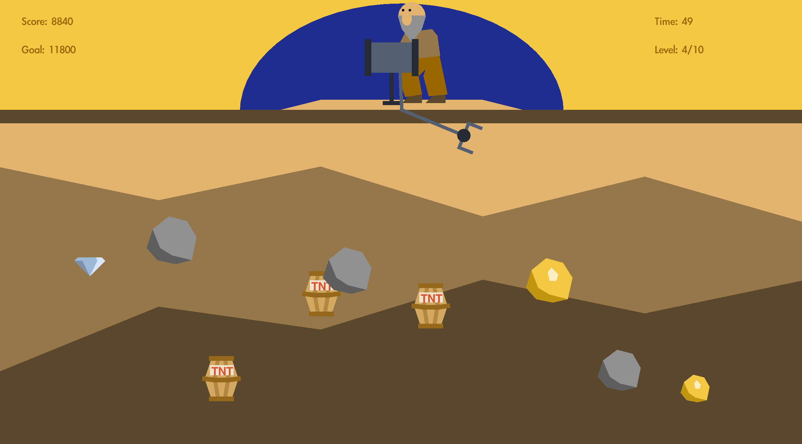
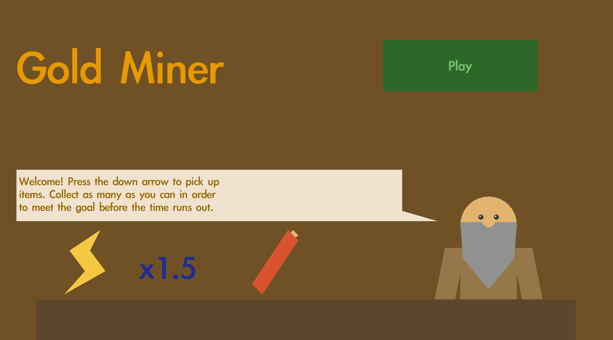
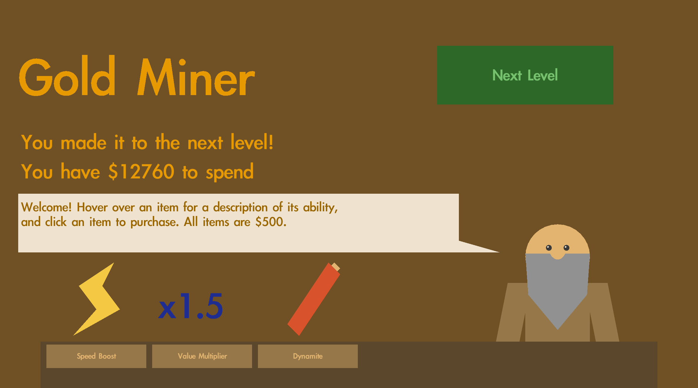

# Welcome to Gold Miner!

This is a pure-Java implementation of Gold Miner, the [classic internet game](https://www.crazygames.com/game/gold-miner). 

<figure>
  
</figure>

The objective of the game is simple: collect enough gold nuggets and diamonds to advance to the next level while avoiding being blown up by TNT. The mining claw is always moving, and you control the timing of when to extend the claw. The down-arrow controls this action, as described in the rules below:

<figure>
  
</figure>

There are also power-ups you can purchase with the points you have collected at the end of each level. The first power-up is a speed bost, which increases the speed of the claw's extension/retraction; the second is a value multiplier, which increases the additional score per item; and the third is a dynamite stick, which counteracts the effect of picking up TNT:

<figure>
  
</figure>

***

To play the game for yourself, clone the repository and run the following commands:

```
cd src
javac Driver.java
java Driver
```
